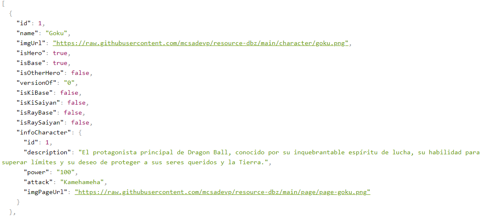
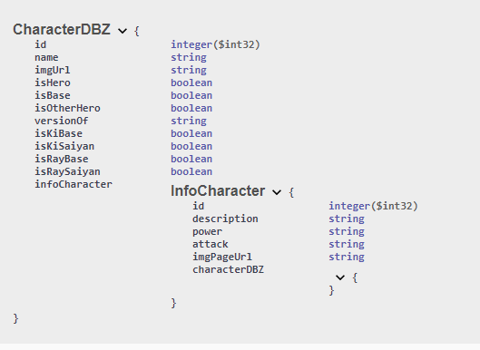

# Dragon Ball z API REST
Este proyecto es una API desarrollada en Java que proporciona datos sobre personajes y versiones de Dragon Ball Z, incluyendo atributos como el ataque de los personajes. El objetivo es gestionar la información de estos personajes utilizando una arquitectura MVC.

## Tabla de Contenidos

- [Descripción](#descripción)
- [Capturas de Pantalla](#capturas-de-pantalla)
- [Instalación](#instalación)
- [Uso](#uso)
- [Licencia](#licencia)
- [Contacto](#contacto)

## Descripción
La API de Dragon Ball Z está diseñada para gestionar personajes y sus respectivas versiones. Cada personaje tiene diferentes atributos, como el nivel de ataque,imagenes y cuenta con varias versiones que también tienen sus propios atributos. La API permite obtener personajes y versiones, manejando relaciones entre ellos.

### Tecnologías utilizadas:

- **Lenguaje:** Java
- **Framework:** Spring Boot
- **Arquitectura:** MVC (Model-View-Controller)
- **Spring Data JPA**: Para la interacción con bases de datos utilizando JPA (Java Persistence API).
- **PostgreSQL**: Sistema de gestión de bases de datos relacional utilizado para almacenar datos.
- **Spring Web**: Para crear aplicaciones web y RESTful.
- **SpringDoc OpenAPI**: Para generar documentación automática de la API.
- **Lombok**: Para reducir la verbosidad del código Java a través de anotaciones.

### Características:

- Documentación de la API con Swagger.
- Gran cantidad de personajes y versiones.
- Relación entre personajes y sus versiones.
- End Point GET /api/characters
- End Point GET /api/info


## Capturas de Pantalla




## Instalación

Sigue estos pasos para instalar el proyecto localmente:

1. Clona el repositorio:
   ```bash
   git clone https://github.com/McKingston01/api-dbz.git

2. Instalar dependencias:
   ```bash
    mvn clean install

2. Ejecución:
   ```bash
    mvn spring-boot:run

## Licencia
Este proyecto no tiene una licencia formal. Puedes usar y modificar el código para proyectos personales o educativos. Para otros usos, por favor contactar.

## Contacto
- LinkedIn: [https://www.linkedin.com/in/mcsadevp/](https://www.linkedin.com/in/mcsadevp/)
- Email: mc.sa.kingston@gmail.com

## By McKingston
